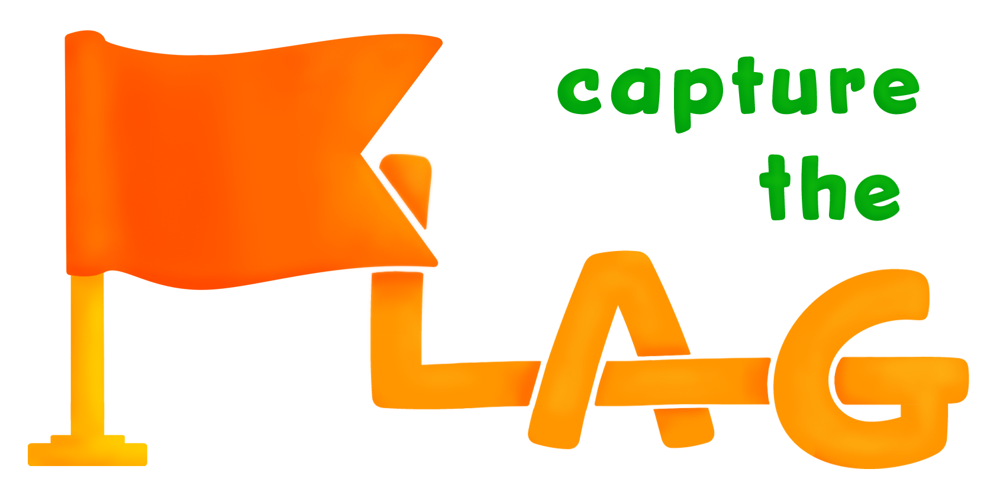

# CaptureTheFlag

IS 2020 project by Junipero team

**Actually this README will be available only in ITALIAN, sorry for the inconvenience. :c**

> Il gioco “ruba bandiera” si forma di due squadre nemiche che si sfidano. 
>Ogni squadra avrà un fortino, dove sarà custodita la propria bandiera. 
>I componenti di ciascuna squadra dovranno catturare la bandiera degli avversari
> e proteggere la propria bandiera, affinché non venga presa. 
>Vince la squadra che prende per prima la bandiera avversaria.

L’app è stata pensata per essere appunto un supporto tecnologico ad un celebre gioco per bambini, 
ma vuole inoltre motivare i fruitori dell’app stessa, che essi siano ragazzi o adulti, 
a svolgere attività fisica in uno spazio aperto, necessariamente molto ampio. 
L’app rompe le barriere date dal fatto di non dover avere la strumentazione fisica 
(es bandiere, fortini), e rende più comodo il gioco grazie all’uso del solo smartphone: 
per esempio, quando un giocatore corre, può tranquillamente metterlo in tasca. 
Quest’app è un ottimo mezzo per potersi interrompere, staccare dai propri impegni e permette 
a chiunque di divertirsi e mettersi in moto. È stato pensato per chi ormai non gioca da parecchio 
tempo a ruba bandiera e gioverebbe nel riscoprire un tradizionale gioco alla portata di tutti. 
L’obiettivo è anche quello di riportare alla luce il gioco, modernizzandolo e renderlo più 
accessibile a tutti, e dare una motivazione in più a chi vorrebbe riprendere a fare 
esercizio fisico, ma non è sufficientemente invogliato.